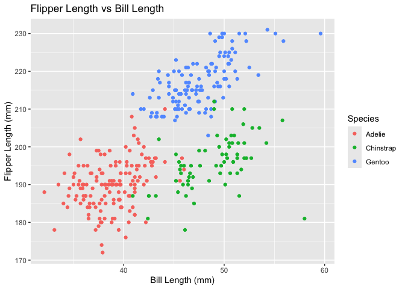

Homework 1
================
Yiman Rui
2026-09-25

Libraries:

``` r
library(tidyverse)
```

    ## Warning: package 'tibble' was built under R version 4.5.2

    ## Warning: package 'dplyr' was built under R version 4.5.2

    ## ── Attaching core tidyverse packages ──────────────────────── tidyverse 2.0.0 ──
    ## ✔ dplyr     1.2.1     ✔ readr     2.1.5
    ## ✔ forcats   1.0.1     ✔ stringr   1.6.0
    ## ✔ ggplot2   4.0.0     ✔ tibble    3.3.1
    ## ✔ lubridate 1.9.4     ✔ tidyr     1.3.1
    ## ✔ purrr     1.1.0     
    ## ── Conflicts ────────────────────────────────────────── tidyverse_conflicts() ──
    ## ✖ dplyr::filter() masks stats::filter()
    ## ✖ dplyr::lag()    masks stats::lag()
    ## ℹ Use the conflicted package (<http://conflicted.r-lib.org/>) to force all conflicts to become errors

## Problem 1

``` r
data("penguins", package = "palmerpenguins")
```

The `penguins` dataset contains measurements of penguins from three
species: Adelie,Gentoo,Chinstrap, observed on the islands:
Torgersen,Biscoe,Dream. Other important numeric variables include bill
length, bill depth, flipper length, body mass, and year.

The dataset contains 344 observations and 8 variables. The mean flipper
length is 200.92 mm.

Plots:

``` r
penguins_plot =
  ggplot(
    penguins,
    aes(
      x = bill_length_mm,
      y = flipper_length_mm,
      color = species
    )
  ) +
  geom_point(na.rm = TRUE) +
  labs(
    title = "Flipper Length vs Bill Length",
    x = "Bill Length (mm)",
    y = "Flipper Length (mm)",
    color = "Species"
  )

penguins_plot
```

<!-- -->

``` r
ggsave(
  "penguins_scatterplot.png",
  plot = penguins_plot,
)
```

    ## Saving 7 x 5 in image

## Problem 2

``` r
set.seed(8105)

df =
  tibble(
    random_sample = rnorm(10),
    sample_positive = random_sample > 0,
    character_vector = c(
      "a", "b", "c", "d", "e",
      "f", "g", "h", "i", "j"
    ),
    factor_vector = factor(
      c(
        "A", "B", "C", "A", "B",
        "C", "A", "B", "C", "A"
      )
    )
  )

df
```

    ## # A tibble: 10 × 4
    ##    random_sample sample_positive character_vector factor_vector
    ##            <dbl> <lgl>           <chr>            <fct>        
    ##  1        0.674  TRUE            a                A            
    ##  2        1.31   TRUE            b                B            
    ##  3        0.115  TRUE            c                C            
    ##  4        1.07   TRUE            d                A            
    ##  5        0.155  TRUE            e                B            
    ##  6        2.12   TRUE            f                C            
    ##  7       -0.219  FALSE           g                A            
    ##  8       -0.113  FALSE           h                B            
    ##  9       -0.0651 FALSE           i                C            
    ## 10        0.476  TRUE            j                A

Mean of each variables:

``` r
mean(pull(df, random_sample))
```

    ## [1] 0.5520184

``` r
mean(pull(df, sample_positive))
```

    ## [1] 0.7

``` r
mean(pull(df, character_vector))
```

    ## Warning in mean.default(pull(df, character_vector)): argument is not numeric or
    ## logical: returning NA

    ## [1] NA

``` r
mean(pull(df, factor_vector))
```

    ## Warning in mean.default(pull(df, factor_vector)): argument is not numeric or
    ## logical: returning NA

    ## [1] NA

The mean can be calculated for the numeric and logical variables, but
not for the character or factor variables. The numeric variable contains
quantitative values so it has a meaningful mean. For the logical
variable, R treats `TRUE` as 1 and `FALSE` as 0, so its mean represents
the proportion of observations that are `TRUE`. Character and factor
variables represent non-numeric information, so their means are not
directly meaningful.

``` r
as.numeric(pull(df, sample_positive))
as.numeric(pull(df, character_vector))
as.numeric(pull(df, factor_vector))
```

When converting the logical variable to numeric, the value change from
`TRUE` to 1 and `FALSE` to 0, which explains why the mean can be
calculated. Converting the character variable to numeric produces
missing values because the character strings cannot be interpreted as
numbers. When converting the factor variable, it returns to the integer
codes associated with its factor levels. Although the factor can
therefore be converted to numbers, these numbers represent category
codes rather than quantitative values, so their mean is still not
meaningful.
